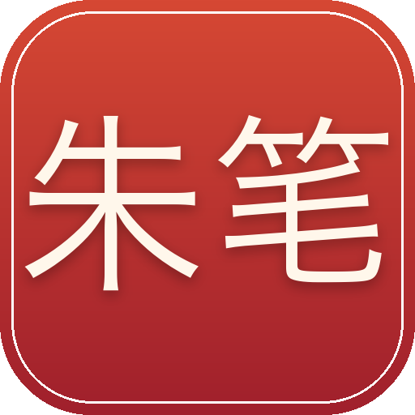
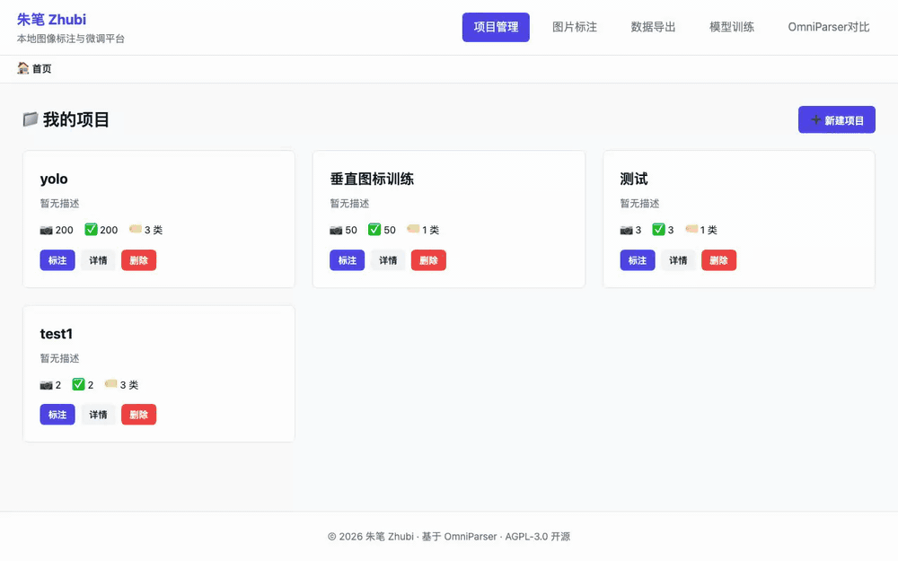
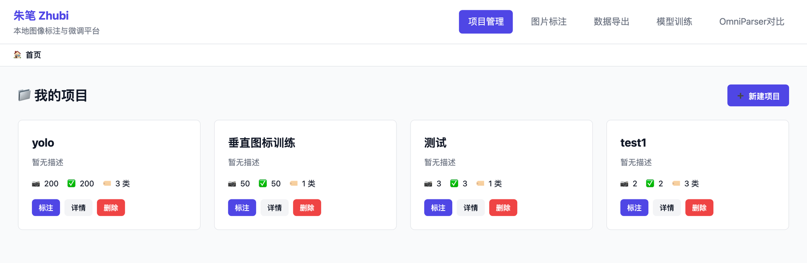
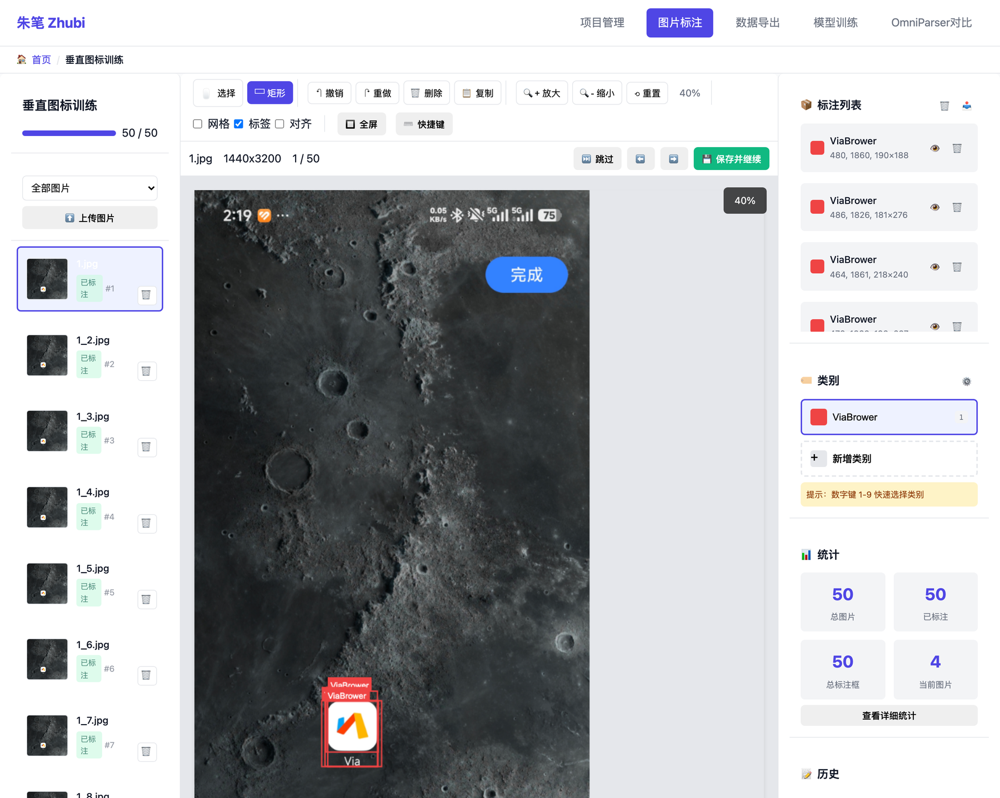
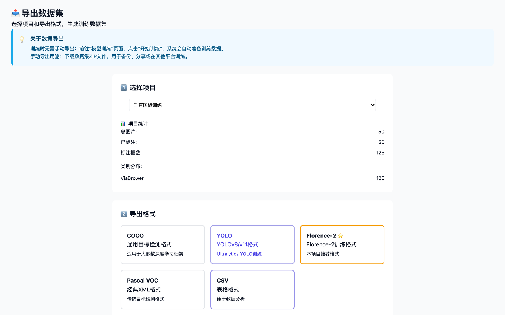
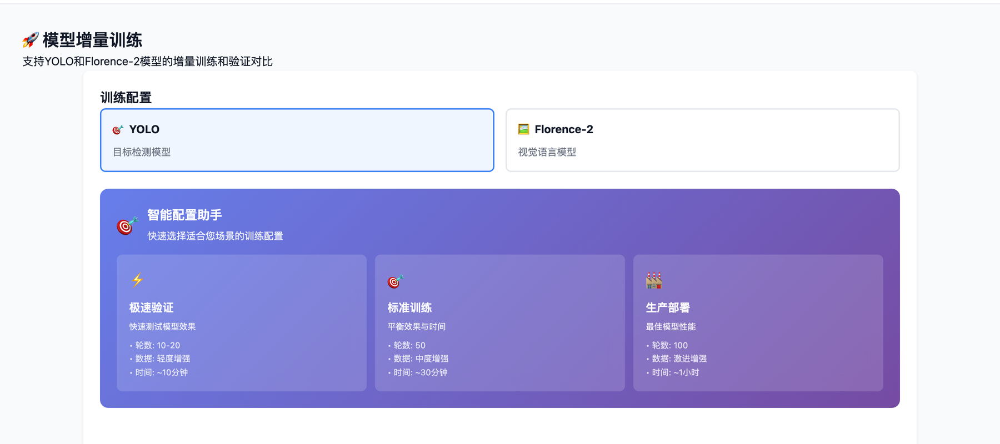
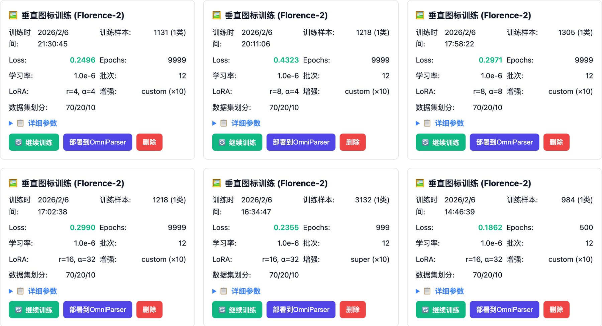

<p align="center">
  
</p>

<h1 align="center">朱笔 Zhubi</h1>

<p align="center">
  <b>本地图像标注与微调平台</b><br>
  在自己的机器上拖框标注、导出数据集、微调 Florence-2 或 YOLO、验证效果，数据不出门。
</p>

<p align="center">
  <i>A self-hosted image annotation and fine-tuning workbench. Label, export, train and validate on your own machine.</i>
</p>

<p align="center">
  <a href="LICENSE"></a>
  
  
  
  
</p>

<p align="center">
  <a href="#快速开始">快速开始</a> ·
  <a href="#它能做什么">它能做什么</a> ·
  <a href="#适合谁">适合谁</a> ·
  <a href="#路线图">路线图</a> ·
  <a href="#开发者指南">开发者指南</a> ·
  <a href="README.en.md">English</a>
</p>

> **技术验证 Demo**，从源码运行。在 macOS（Apple Silicon）上开发与验证，Linux 与 NVIDIA GPU 走同一套代码但未系统测试。训练需要上游 [OmniParser](https://github.com/microsoft/OmniParser) 的权重作为基础模型；只做标注和导出则不需要。

<p align="center">
  
</p>
<p align="center">
  <sub>打开「垂直图标训练」项目，在手机截图上拖框标出浏览器图标，保存后自动进入下一张；再到导出页选 YOLO 格式。画面来自本地真实项目：50 张截图、125 个标注框。</sub>
</p>

## 你是否也在这样工作

- 想给自己的产品界面训一个图标检测模型，但标注工具、导出脚本、训练脚本、验证脚本分散在四个地方，每换一步都要改路径。
- 在线标注平台要把截图传上去。内部系统的截图不能出公司，只能自己拼工具。
- 标了一批数据，训练完效果不好，不知道是数据的问题还是参数的问题，也没法和基础模型放在一起比。
- 用 OmniParser 做 GUI Agent，垂直应用里的图标它认不出来，想补几百个样本微调一下，却找不到顺手的工具。

朱笔把这条链路放进一个本机运行的网页里：建项目、拖框标注、一键导出五种格式、用 LoRA 微调 Florence-2 或训练 YOLO、上传一张图对比训练前后的效果。

## 它能做什么

### 1. 建项目，传图片

一个项目对应一套类别和一批图片。批量上传后，卡片上直接看到图片数、已标注数和类别数。

<p align="center"></p>
<p align="center"><sub>四个本地项目，其中「垂直图标训练」50 张全部标完，「yolo」200 张、3 个类别。</sub></p>

### 2. 拖框标注，用键盘赶进度

在画布上拖出矩形，数字键 1 到 9 切换类别，S 保存，N 下一张，D 删除，Ctrl+Z 撤销。右侧实时列出当前图片的每一个框和坐标，网格、标签、对齐吸附都可以开关，标注进度写在左上角。

<p align="center"></p>
<p align="center"><sub>一张 1440×3200 的手机截图，浏览器图标上叠着三个「ViaBrower」框；右侧是这张图的框列表、类别面板和项目统计。</sub></p>

### 3. 一键导出五种格式

同一份标注可以导成 COCO、YOLO、Pascal VOC、CSV，以及 Florence-2 微调专用的格式。训练集、验证集、测试集按比例自动划分，导出前可以叠加数据增强和自动负样本。

<p align="center"></p>
<p align="center"><sub>选中「垂直图标训练」后显示 50 张、125 框、类别分布，下方选 YOLO 格式。</sub></p>

### 4. 在本机微调

选 YOLO 或 Florence-2，再从「极速验证」「标准训练」「生产部署」三档预设里挑一个，或者自己调轮数、学习率、LoRA 秩、增强策略。训练在后台跑，页面实时显示 loss、轮次和日志，中途可以停、可以续。

<p align="center"></p>
<p align="center"><sub>训练配置区：YOLO 或 Florence-2，三档预设写明轮数、增强强度和预计时间。</sub></p>

### 5. 每一次训练都留档，随时续训或部署

训练完成的模型按项目和时间排列，卡片上记着样本数、最终 loss、学习率、LoRA 参数和数据划分。可以从这个模型继续训练，也可以一键把它部署到 OmniParser 的权重目录。

<p align="center"></p>
<p align="center"><sub>「垂直图标训练」项目下的六次 Florence-2 微调记录，不同 LoRA 秩和增强策略下的 loss 一目了然，每张卡片都能继续训练或部署。</sub></p>

### 6. 上传一张图，看训练前后的差别

验证页上传一张新截图，同时跑基础模型和微调模型，并排显示识别结果；OmniParser 对比页则用完整的 OmniParser 流程（YOLO 检测加 Florence-2 描述）对比两套权重的屏幕解析效果。

## 适合谁

- **用 OmniParser 或类似 GUI Agent 的人**：原模型认不出你产品里的图标，需要补样本微调。
- **做界面元素检测的测试或 RPA 团队**：截图不能上传到第三方平台，需要本机完成标注到训练。
- **小规模视觉项目的独立开发者**：几百张图、几个类别，不想为一个 YOLO 模型搭一套 MLOps。
- **想看懂 LoRA 微调到底改了什么的人**：每次训练的参数和 loss 都留在卡片上，可以对比。

## 快速开始

需要：Python 3.10+ 和一个现代浏览器。

```bash
git clone https://github.com/icesword0760/zhubi.git
cd zhubi
pip install -r requirements.txt

python app.py
```

打开 <http://localhost:8003>，新建项目、上传图片就可以开始标注和导出。

**要训练或对比模型**，还需要一份 OmniParser 仓库及其权重（`weights/icon_detect`、`weights/icon_caption_florence`）。把它放在朱笔的同级目录 `../OmniParser`，或者用环境变量指定：

```bash
export OMNIPARSER_ROOT=/path/to/OmniParser
python app.py
```

`config.yaml` 里可以改端口、数据目录、导出划分比例、训练默认参数和快捷键。训练产物、导出包和上传的图片都放在 `data/` 下，不会进入仓库。

## 路线图

以下都还没有做：

- 验证页的「已训练 YOLO 模型」列表。目前只列出基础模型，训练出的 YOLO 权重要手动填路径。
- 安装包或 Docker 镜像。目前只能从源码运行。
- Linux 与 NVIDIA GPU 的系统性验证。
- 多人协作与标注审核。现在是单人单机的工具。
- 多边形、关键点等矩形之外的标注类型。

## 开发者指南

<details>
<summary><b>项目结构</b></summary>

```
app.py                     Flask 入口：项目、标注、导出、训练、验证与对比的全部 API，并托管前端
backend/
  project_manager.py       项目与图片管理
  annotation_manager.py    标注读写与边界校验
  crop_manager.py          按标注框裁切图标样本
  export_manager.py        COCO / YOLO / VOC / CSV / Florence-2 导出与数据划分
  data_augmentor.py        数据增强
  train_manager.py         Florence-2 LoRA 微调（含续训、提前停止）
  yolo_train_manager.py    YOLO 训练
  model_validator.py       单模型验证与双模型对比
add_negative_samples.py    自动负样本
frontend/                  纯 HTML + CSS + JS，无构建步骤
tests/                     unittest 回归测试（python -m unittest discover -s tests）
scripts/capture_assets.py  用 Playwright 重新生成 README 的截图和 GIF
docs/                      标注、训练、导出格式、续训、增强的详细说明
```

</details>

<details>
<summary><b>与 OmniParser 的关系</b></summary>

朱笔不包含 OmniParser 的代码或权重。训练时从 `OMNIPARSER_ROOT/weights` 读取基础模型，「OmniParser 对比」和自动负样本功能会导入 `OMNIPARSER_ROOT/util`。这两部分缺席时，标注、导出和 YOLO 从头训练仍然可用。

</details>

## 反馈与协议

遇到问题或有想法，欢迎在 [Issues](https://github.com/icesword0760/zhubi/issues) 里说。

本项目以 [AGPL-3.0](LICENSE) 协议开源：可以自由使用、修改和分发，但基于它修改后的版本，无论是分发还是作为网络服务提供，都需要以同样的协议公开源码。如果它帮你省下了拼标注和训练脚本的时间，点个 Star 让更多人看到。
